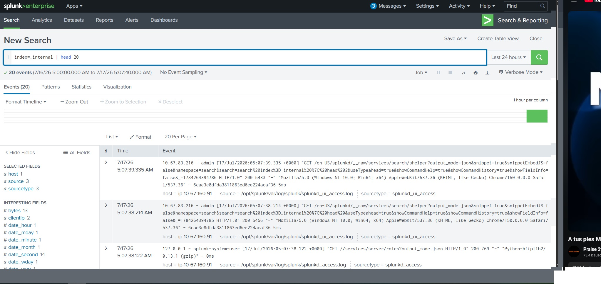
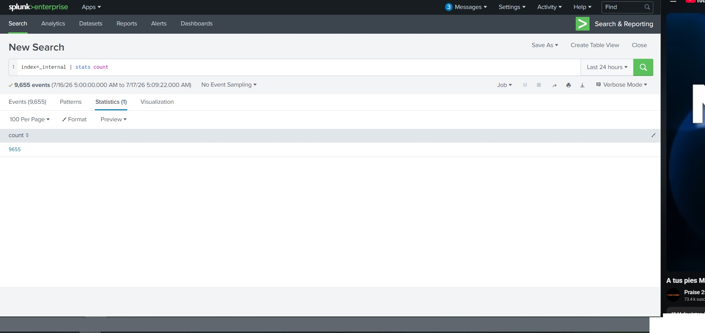
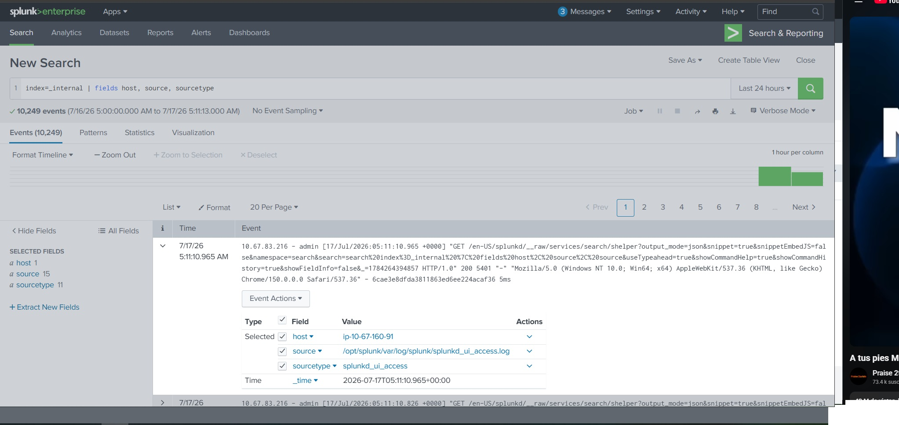

## Evidencia del Laboratorio

A continuación, presento las capturas de pantalla de la práctica de comandos básicos en la interfaz de Splunk (Entorno TryHackMe):

**1. Búsqueda General y Exploración de Campos**

**2. Limitando resultados con comando Head**

**3. Generación de métricas con Stats Count**

**4. Optimización de búsqueda con Fields**
